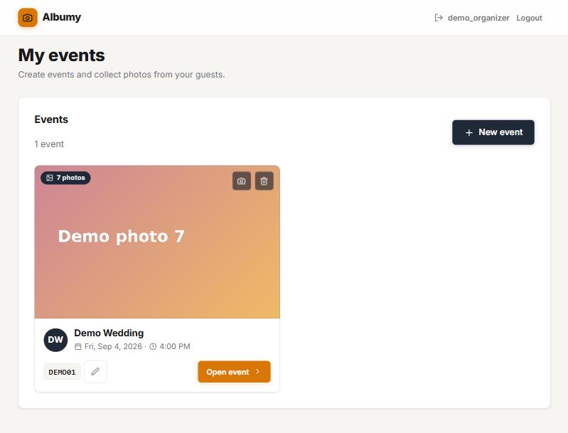
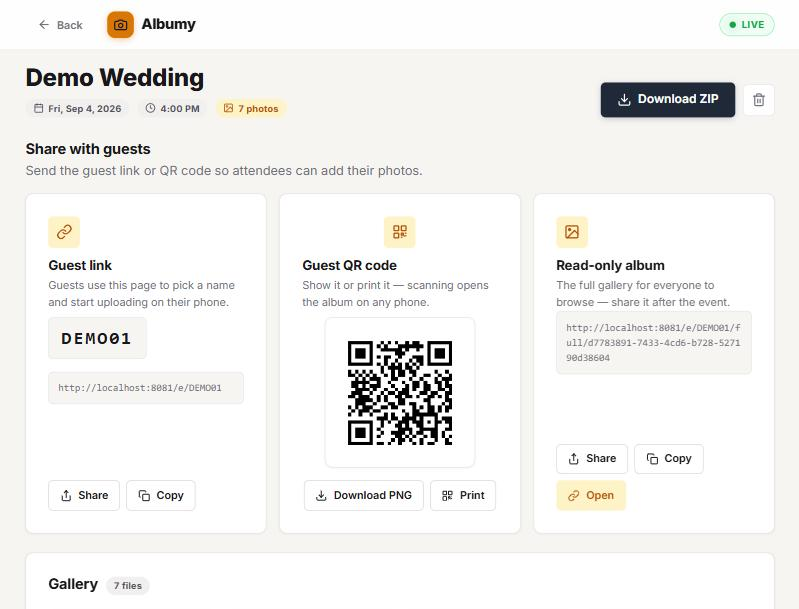
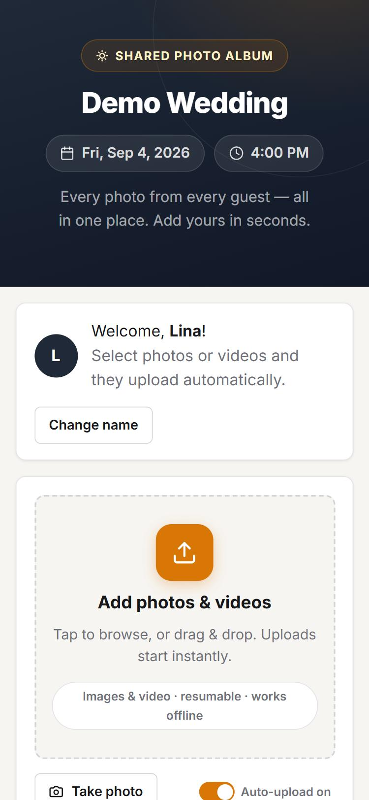
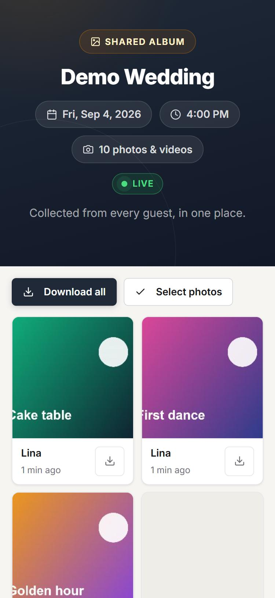
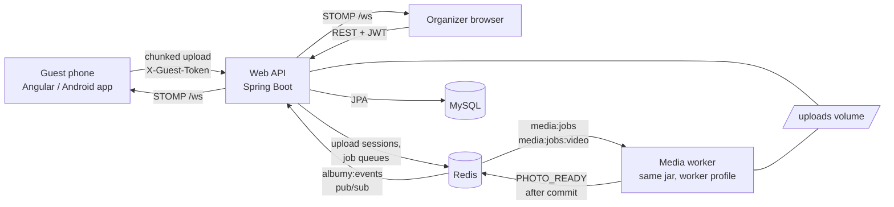

# Albumy — Event Photo-Sharing App

Weddings, parties and conferences produce hundreds of photos spread over dozens of phones and group chats. Albumy gives every event one shared album: the organizer shares a single QR code or link, and every guest drops their photos and videos into it — **no sign-up required**. Uploads are chunked and resumable, media is processed in the background by a worker, and new photos appear in everyone's gallery **live** over WebSockets. A read-only public album lets visitors save photos at full quality; organizers download everything as a ZIP.

**Spring Boot 4.1 · Java 21 · MySQL · Redis · STOMP/WebSocket · Angular 20 · Capacitor (Android) · Docker**

[](https://github.com/Majdabbassi/Albumy/actions/workflows/ci.yml)

| Organizer dashboard | Event page: QR, links, live gallery |
|---|---|
|  |  |

| Guest page (no account) | Read-only album |
|---|---|
|  |  |

## Live demo

**<https://majdabbassi.github.io/Albumy/>** (frontend on GitHub Pages, API on Render's free plan)

- Sign in as `demo_organizer` / `demo_organizer_password`, or open the guest page directly: [`/e/DEMO01`](https://majdabbassi.github.io/Albumy/e/DEMO01).
- The API sleeps after ~15 minutes idle; the first request can take from 20 seconds to a few minutes while it wakes up.
- It is a shared public demo on a disposable disk: uploads disappear when the server sleeps and the seeded *Demo Wedding* is rebuilt on every start. Please don't upload anything personal.

---

## Architecture



Locally, `docker compose up` runs MySQL, Redis, the web API, the media worker, the Angular app behind nginx and phpMyAdmin. On the free host, one instance runs the web API **and** the worker (`embedded-worker` profile) because free tiers have no background workers — same code, different profile.

**Upload path.** `POST /uploads` opens an upload session in Redis (24 h TTL) and returns the chunk size (5 MB). The client `PUT`s raw chunks; `GET /uploads/{id}/chunks` tells it which chunks the server already has, so a retry or a page reload re-sends only what is missing. `POST /uploads/{id}/complete` assembles the file on disk (up to 2 GB, streamed, never in memory), checks that its bytes match an allowed image/video signature, de-duplicates by SHA-256, saves the photo as `PROCESSING` and pushes a job on a Redis list. On the client, an IndexedDB-persisted queue keeps 3 uploads in flight, retries 3 times with backoff, pauses offline and survives reloads; large photos are compressed to at most 2560 px first when that makes them smaller.

**Media worker.** The same jar started with the `worker` profile (web server off). It pops image jobs before video jobs, writes `_thumb`/`_med`/`_full` JPEG tiers (320/960/1920 px), an H.264 `_web.mp4` and a poster for videos (ffmpeg), reads EXIF capture date and orientation, and marks the photo `READY`. A failing job is retried up to 3 times, then marked `ERROR`; photos stuck in `PROCESSING` for 30 minutes (worker down) are re-queued.

**Realtime.** The worker is not the process holding the WebSocket sessions, so it publishes `PHOTO_READY` on the Redis channel `albumy:events`, **after its database transaction commits**. The web API bridges that channel to STOMP topics `/topic/events/{id}/photos` and `/activity`. Every subscription is checked: an organizer or admin needs their JWT, a guest or album visitor needs an HMAC-signed *realtime ticket* bound to that event (returned with the guest page or album data, valid 24 h). When a socket reconnects, the page re-fetches the gallery so nothing missed while offline is lost.

**Who can do what** is decided per request from the JWT (admin, organizer) or the `X-Guest-Token` header (a guest, scoped to one pseudo in one event); the read-only album is reached through a separate unguessable token.

## Key decisions and trade-offs

1. **A queue and a separate worker instead of processing in the upload request.**
   *Why:* transcoding a 1 GB video or generating three JPEG tiers takes seconds to minutes; doing it in the request would tie up web threads and lose the work if the process restarts. *Cost:* a second process and Redis to operate, and photos are briefly shown as processing. *Alternative:* `@Async` inside the web process is simpler but competes with requests for CPU and loses queued work on a crash. The free deployment runs the worker embedded, which proves the code does not depend on two machines.
2. **Redis pub/sub in front of STOMP, published after commit.**
   *Why:* it is the simplest way for the worker to reach browsers connected to another process, and publishing only after commit means a client that re-fetches on the message reads the new row (the original code raced and showed `PROCESSING`). *Cost:* pub/sub keeps no history, so a disconnected client misses messages; pages therefore re-fetch on reconnect.
3. **Resumable chunked uploads.**
   *Why:* phones on venue Wi-Fi drop connections constantly; with 5 MB chunks a failure costs one chunk, not the whole video. *Cost:* server-side session state (Redis) and temporary files, cleaned by the session TTL.
4. **Guests without accounts.**
   *Why:* asking a wedding guest to sign up loses most of the photos. A guest picks a pseudo (unique per event) and gets a random token. *Cost:* a weaker identity, so organizers keep moderation (delete any photo) and the public endpoints are rate-limited per IP; a guest can only list and delete their own uploads.
5. **JWT in `localStorage`.**
   *Why:* the Capacitor Android app needs the bearer token for native HTTP calls, and HttpOnly cookies cannot be set cross-origin for it. *Cost:* a script injected into the page could read it, so the realistic injection vector is closed instead: only safe image/video types are accepted, `/files` is served with `nosniff` and `Content-Security-Policy: sandbox`, and Angular never renders raw HTML.
6. **Local disk storage.**
   *Why:* zero cost and simplest to run with Docker. *Cost:* it does not survive a free host's ephemeral disk; the demo uses `StorageReconciler` to drop photo rows whose files are gone and re-seed the demo event on start. Real data would need object storage.

## Security model

| Who | How they are identified | Can |
|---|---|---|
| Admin | JWT | create organizer invites, see and manage every event |
| Organizer | JWT (account created from a single-use invite) | create and edit their events, moderate photos, download the ZIP |
| Guest | `X-Guest-Token` for one pseudo in one event | upload, list and delete their own photos |
| Visitor | full-album token in the URL | view and save the event's photos (read-only) |

- Registration requires a valid invite; the invite is burned with an atomic conditional update **after** the account is saved, so two concurrent registrations cannot use one invite and a failed save never consumes it.
- Event codes come from `SecureRandom`; invite and full-album tokens are UUIDs.
- Public endpoints are rate-limited with a sliding window (`app.rate-limit.*`): login per IP **and** per username, registration, event-code probing, pseudo checks, claims and upload init/complete.
- The API refuses to start with a missing, short or published `JWT_SECRET`.
- Redis, MySQL and phpMyAdmin are published on `127.0.0.1` only, and Redis requires a password; only the app ports (`8080`, `8081`) are reachable from the LAN for phone testing. The backend container runs as a non-root user.

**What the audit found and fixed** (by running the stack in a real browser; 17 bugs): login always answered 500 (the rate-limit filter consumed the request body); every PNG and JPEG was rejected (sign-extended bytes in the signature check); the worker crashed (missing JWT secret) and never marked photos `READY` (detached entity); images broke behind nginx; live updates were dead in the Docker build and then sent unreadable payloads; events were published before the commit; timestamps were off by the server's timezone; event deletion failed; and more. After deployment, `X-Guest-Token` was missing from the CORS headers and a wrong password answered 500 instead of 401. Each fix has a regression test where one was possible.

## Features

| Area | Features |
|---|---|
| **Guests** | QR code, link or `albumy://` deep link; unique pseudo per event (server-checked), remembered on the device |
| **Uploads** | 5 MB chunks, up to 2 GB per file, resume from the server's list of received chunks, 3 retries with backoff, IndexedDB queue that survives reloads, offline pause and auto-resume, 3 in flight, camera capture, client-side compression |
| **Media** | JPEG tiers (320/960/1920), H.264 video + poster, EXIF date and orientation |
| **Live** | `PHOTO_ADDED` / `PHOTO_READY` / `PHOTO_REMOVED` / `ACTIVITY` pushed to the guest page, full album, organizer gallery and dashboard |
| **Sharing** | downloadable/printable QR, Web Share and copy, read-only album where visitors save one, several or all photos at original quality |
| **Organizer** | gallery tagged by uploader with cursor pagination, edit event details, cover photo, delete photos or the event, streamed ZIP |
| **Mobile** | Android wrapper via Capacitor 8 (debug build, not part of CI) |

## Run with Docker (recommended)

Prerequisite: **Docker Desktop** (or Docker Engine + Compose). Java, Node and Maven are not needed.

```bash
git clone https://github.com/Majdabbassi/Albumy.git && cd Albumy
cp .env.example .env
# generate a JWT signing key and put it in .env (see .env.example):
openssl rand -hex 32
docker compose up -d --build
```

| Service | URL | Notes |
|---|---|---|
| Frontend | http://localhost:8081 | the app |
| Backend API | http://localhost:8080 | `/api/...` proxied by nginx |
| phpMyAdmin | http://localhost:8082 | MySQL UI (loopback only; user `albumy`, password from `.env`) |
| Redis | localhost:6379 | loopback only, password-protected |
| MySQL | localhost:3306 | loopback only |

Demo data is created on first boot: an admin, an organizer, the `Demo Wedding` event (code **`DEMO01`**, guest page `/e/DEMO01`) with 7 placeholder photos from the pseudos `Amelie`, `Karim` and `Sam`, and one unused invite link.

| Role | Username | Password |
|---|---|---|
| Admin | `demo_admin` | `demo_admin_password` |
| Organizer | `demo_organizer` | `demo_organizer_password` |

Stop the stack with `docker compose down` (keeps data); wipe everything with `docker compose down -v`.

**Try the whole flow:** log in as `demo_admin` and generate an invite → open the invite link and register an organizer → create an event → open its guest link on your phone (same Wi-Fi, `http://<your-ip>:8081/e/CODE`), pick a pseudo and upload → watch the photo appear live on the organizer's page → download the ZIP.

## Local development (without Docker)

```bash
# 1) MySQL 8 at localhost:3306 with an `albumy` database/user, and Redis at localhost:6379
#    (or point DB_URL/DB_USER/DB_PASSWORD and REDIS_* at your instances).

# 2) Backend on :8080
cd albumy_backend
set JWT_SECRET=<paste-your-generated-secret>   # Windows  (export JWT_SECRET=... on Linux/macOS)
mvnw.cmd spring-boot:run        # Windows        (./mvnw spring-boot:run on Linux/macOS)

# 3) Media worker (without it photos stay PROCESSING): a second instance with the worker profile
SPRING_PROFILES_ACTIVE=worker mvnw.cmd spring-boot:run

# 4) Frontend on :4200 (proxies /api and /ws to :8080)
cd ../albumy_frontend
npm install
npm start
```

## Configuration (`.env`)

| Variable | Used by | Default |
|---|---|---|
| `JWT_SECRET` | backend JWT signing key | **required** — `openssl rand -hex 32`; the app refuses to boot with the placeholder (this repo is public) |
| `MYSQL_ROOT_PASSWORD` | compose (MySQL) | `albumy_root` |
| `MYSQL_DATABASE` | compose (MySQL) | `albumy` |
| `MYSQL_USER` / `MYSQL_PASSWORD` | MySQL + backend + phpMyAdmin | `albumy` / `albumy` |
| `REDIS_PASSWORD` | Redis (`requirepass`) | `albumy_redis` |
| `MYSQL_HOST_PORT` / `REDIS_HOST_PORT` | host ports for MySQL / Redis | `3306` / `6379` (change them if another project uses these) |
| `FRONTEND_URL` | invite registration links | `http://localhost:8081` |
| `CORS_ALLOWED_ORIGINS` | backend CORS (comma-separated) | web origins + `https://localhost`, `capacitor://localhost` |
| `UPLOAD_DIR` | file storage | `uploads` (`/app/uploads` volume in the container) |

Backend-only settings live in `albumy_backend/src/main/resources/application.properties`: JWT lifetime (24 h), invite validity (7 days), chunk size (5 MB), max file (2 GB), upload-session TTL (24 h), Redis keys (`media:jobs`, `media:jobs:video`, `albumy:events`), worker threads (2), job recovery (30 min), image tiers (`320,960,1920`) and the rate limits.

## Tests & CI

```bash
cd albumy_backend
./mvnw test                         # unit tests (no services needed)
DB_URL=jdbc:mysql://localhost:3306/albumy_it?createDatabaseIfNotExist=true DB_USER=root DB_PASSWORD=... ./mvnw test   # also runs the MySQL/Redis integration tests
```

18 tests. 15 run anywhere: file-signature checks (7), the rate limiter (3: the login body stays readable, per-username throttling, oversized bodies refused), CORS headers for the guest token (2), the Redis-to-STOMP bridge payload, timestamp serialization and the 401 on a wrong password. 3 integration tests (context start-up, event deletion, storage reconcile) need MySQL and Redis and run in CI. Each regression test was checked to fail without its fix. GitHub Actions runs the backend tests against MySQL and Redis service containers, builds the Angular app and validates `docker-compose.yml`.

Not covered by automated tests yet: the ownership rules (organizer vs organizer, guest vs guest), and the video pipeline end to end (reviewed in code, not run with a real video).

## Deploy it for free

The same setup as the live demo.

| Piece | Where | Notes |
|---|---|---|
| Frontend (Angular) | GitHub Pages, via [`pages.yml`](.github/workflows/pages.yml) | Built with `--base-href /Albumy/`; set the repo variable `ALBUMY_API_URL` to your API URL |
| API + media worker | Render free web service, via [`render.yaml`](render.yaml) | Docker build, 512 MB: heap capped, one media thread, `embedded-worker` profile |
| MySQL | any free MySQL-compatible database | e.g. TiDB Cloud Serverless or Aiven; use TLS in `DB_URL` |
| Redis | any free Redis/Valkey **without a tight command cap** | The worker polls Redis (`MEDIA_JOBS_POLL_MS`, 1 s on the demo); plans that cap commands per month, such as Upstash's, run out quickly |

1. Create the database and Redis instance and keep their connection details.
2. On Render choose **New → Blueprint** and select this repository. Fill in the variables marked *sync: false* in `render.yaml`: `DB_URL` (for example `jdbc:mysql://HOST:PORT/albumy?sslMode=REQUIRED&serverTimezone=UTC`), `DB_USER`, `DB_PASSWORD`, `REDIS_HOST`, `REDIS_PORT`, `REDIS_PASSWORD`. `JWT_SECRET` is generated for you. Set `REDIS_SSL` to `true` only if your Redis provider requires TLS.
3. In the repository settings enable **Pages → Source: GitHub Actions**, and add the variable `ALBUMY_API_URL` if your Render URL is not `https://albumy-api.onrender.com`.
4. Push to `main`. Check `https://<your-api>/actuator/health`, then open the Pages URL.

`DEMO_RECONCILE_STORAGE=true` is for the demo only (it deletes photo rows whose files are gone); use object storage for real data.

## API overview

All errors are JSON `{ "message": ... }`. Authenticated endpoints take `Authorization: Bearer <JWT>`; guests send `X-Guest-Token` (from `/claim`). The backend serves its routes at the root (`http://localhost:8080/...`); through the frontend they are under `/api`.

| Method | Path | Access | Purpose |
|---|---|---|---|
| POST | `/auth/register` | public | Register an organizer (valid `inviteToken` required) |
| POST | `/auth/login` | public | Login → JWT |
| GET | `/invites/{token}` | public | Validate an invite (valid/used/expired) |
| POST / GET | `/admin/invites` | ADMIN | Create a single-use invite / list invites |
| POST | `/events` | ORGANIZER | Create an event |
| GET | `/events` | authenticated | List events (ADMIN: all) |
| GET | `/events/{id}?beforeId=&limit=` | owner/ADMIN | Event detail, cursor-paginated photos |
| PUT | `/events/{id}` | owner/ADMIN | Update name, date, start time |
| POST | `/events/{id}/cover` | owner/ADMIN | Set or replace the cover photo |
| DELETE | `/events/{id}` | owner/ADMIN | Delete the event and its files |
| DELETE | `/events/photos/{photoId}` | owner/ADMIN | Delete one photo (publishes `PHOTO_REMOVED`) |
| GET | `/events/{id}/photos/zip` | owner/ADMIN | Stream all photos as a ZIP |
| GET | `/events/code/{eventCode}` | public | Guest event info (+ realtime ticket) |
| GET | `/events/code/{eventCode}/name-available?name=X` | public | Check pseudo availability |
| POST | `/events/code/{eventCode}/claim` | public | Claim a pseudo → `guestToken` |
| GET | `/events/code/{eventCode}/photos?beforeId=&limit=` | guest | The guest's own uploads |
| DELETE | `/events/code/{eventCode}/photos/{photoId}` | guest | Delete one of the guest's own photos |
| POST | `/uploads` | public | Init a chunked upload → `{ uploadId, chunkSize }` |
| PUT | `/uploads/{uploadId}/chunks/{index}` | public | Upload one raw chunk (octet-stream) |
| GET | `/uploads/{uploadId}/chunks` | public | Received chunk indexes (resume) |
| POST | `/uploads/{uploadId}/complete` | public | Assemble, verify, dedupe, enqueue → `PhotoResponse` |
| GET | `/events/full/{fullAlbumToken}?beforeId=&limit=` | public | Read-only full album (+ realtime ticket) |
| GET | `/files/{fileName}` | public | Stream a file or variant (UUID names) |
| WS | `/ws` | JWT or ticket | STOMP → `/topic/events/{id}/photos` and `/activity` |

## Data model

- **users** — username (unique), email, passwordHash (BCrypt), displayName, role (`ADMIN`/`ORGANIZER`), createdAt
- **invites** — token (UUID, unique), used, createdAt, expiresAt (7 days)
- **events** — name, date, startTime, eventCode (unique 6-char), fullAlbumToken (unique UUID), coverFileName, organizerId, createdAt
- **guests** — eventId + name, **unique per event** (one pseudo = one guest identity, many photos)
- **photos** — eventId, guestId, fileName (`UUID.ext`), thumb/med/full/web/poster file names, mimeType, size, width, height, duration, sha256, status (`PROCESSING`/`READY`/`ERROR`), errorCount, captureDate, uploadedAt

The schema is created by Hibernate (`ddl-auto=update`, no migrations). Timestamps are serialized as ISO-8601 instants (`...Z`), so "5 min ago" is right in any timezone.

## Android app (Capacitor)

```bash
cd albumy_frontend
npm run cap:sync            # ng build --configuration capacitor && cap sync android
npm run cap:open            # opens Android Studio
# or: cd android && ./gradlew assembleDebug   (APK under android/app/build/outputs/apk/debug/)
```

The `capacitor` configuration points at `http://10.0.2.2:8080` (the Android emulator's alias for the host); on a physical device, set your machine's LAN IP in `src/environments/environment.capacitor.ts` and re-sync. The backend allows the Capacitor origins (`https://localhost`, `capacitor://localhost`). The manifest registers `albumy://open?code=EVENTCODE` (optionally `&token=FULLTOKEN`) to open the guest page or full album directly.

## Troubleshooting

| Symptom | Fix |
|---|---|
| Backend keeps restarting | MySQL or Redis was not healthy yet; `docker compose logs backend` shows the real error. |
| Photos stuck `PROCESSING` | The worker is not running (`docker compose ps` → `albumy-worker`): `docker compose up -d worker`. Stuck photos are re-queued after 30 minutes. |
| Old tables / left-overs | `docker compose down -v && docker compose up -d --build` (wipes MySQL + uploads, re-seeds demo data). |
| Upload rejected | Over 2 GB, or a file type that is not an allowed image/video; the server's JSON `message` shows in the upload tray. |
| Live updates not appearing | Check the STOMP connection (browser network tab → `ws://…/ws`); the `/ws` location in `nginx.conf` must match exactly. |
| `port is already allocated` for MySQL/Redis | Set `MYSQL_HOST_PORT` / `REDIS_HOST_PORT` in `.env` (e.g. `3307` / `6380`). |

## Repository layout

```
albumy_backend/    Spring Boot application (web + worker in one jar): config, controller, dto, exception, model,
                   repository, security, service/serviceimpl (media queue, processor, realtime)
albumy_frontend/   Angular 20 app, nginx.conf, Capacitor config and generated android/ project
docs/screenshots/  images used in this README
```

## License

For demonstration purposes.
